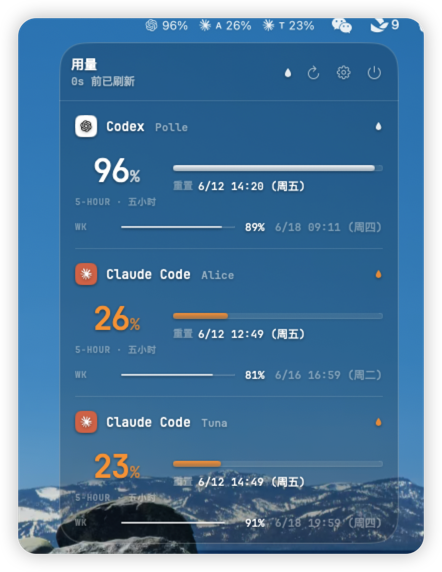

# QuotaGlass

A native macOS menu-bar quota monitor for AI coding subscriptions and API usage (Codex / Claude Code / Sakana API), with a fully transparent terminal-style popover (JetBrainsMono, zero blur).

<p align="center">
  
</p>

## Install

Download `QuotaGlass.app.zip` from the [latest release](https://github.com/zhonghui5207/QuotaGlass/releases/latest), unzip, and drag `QuotaGlass.app` into `/Applications`.

The app is ad-hoc signed (no paid Apple Developer certificate), so the first launch needs one extra step — either:

- Right-click the app → **Open** → **Open** in the dialog, or
- `xattr -d com.apple.quarantine /Applications/QuotaGlass.app`

Then click the menu-bar badge. Accounts are picked up automatically from your logged-in Codex / Claude Code CLIs; more accounts can be added in settings via in-app OAuth login.

## Features

- Menu-bar app, accessory mode, no Dock icon
- Clear Liquid Glass popover (`NSGlassEffectView`, `.clear` style): wallpaper refracts through, monochrome white text hierarchy, color reserved for low-quota warnings (orange <30%, red <10% remaining)
- Brand-colored service tiles (OpenAI black-on-white, Claude white-on-terracotta)
- Glassy gradient progress bars for the 5-hour and weekly windows
- **Fully native credential reading — no Python, no external checker:**
  - Codex: `~/.codex/auth.json` (honors `CODEX_HOME`), JWT-decoded email/plan, automatic token refresh with write-back
  - Claude Code: `~/.claude/.credentials.json` plus every `Claude Code-credentials*` keychain item — multi-profile / multi-account setups appear as separate rows
  - Sakana API: `SAKANA_API_KEY` from the process environment, `~/.codex/.env`, or the legacy `sakana-api-key` Keychain item; validates against `https://api.sakana.ai/v1/models`
- Usage fetched from the official endpoints (`chatgpt.com/backend-api/wham/usage`, `api.anthropic.com/api/oauth/usage`)
- Sakana console billing: sign in once from Settings → Add account → Sakana Console; QuotaGlass then reads its own WebView session and parses subscription windows plus pay-as-you-go credit/usage
- Per-account cache: a transient fetch failure never blanks the UI; affected rows show an orange "旧数据" marker instead
- Background auto-refresh (5/10/15 min, configurable) + immediate refresh on wake from sleep
- Low-quota system notifications: one alert below 30% remaining, another below 10%, re-armed after the window resets
- Settings window: per-account aliases, per-account menu-bar visibility checkboxes, launch at login, notification toggle, refresh interval
- Menu-bar badge shows each checked account as logo + remaining %; when one service has multiple accounts in the badge, an alias initial disambiguates them

## Run in development

```bash
swift run QuotaGlass
```

Notes for dev runs (bare executable, no bundle): notifications and launch-at-login are disabled; they require the `.app`.

Debug helpers:

- `QG_SNAPSHOT=/tmp/qg.png swift run QuotaGlass` — headless PNG render of the popover + menu-bar badge (no screen-recording permission needed)
- `QG_SHOWPANEL=1` — show the panel centered on launch
- `QG_SHOWSETTINGS=1` — open the settings window on launch

## Build the .app

```bash
bash scripts/make_app.sh
open build/QuotaGlass.app
```

The script builds a release binary, copies the SPM resource bundle (required — `Bundle.module` traps without it), writes the Info.plist, and ad-hoc signs the bundle.

## Requirements

- macOS 26+ for the Liquid Glass look; on macOS 14–15 the popover falls back to a dark HUD blur
- Logged-in Codex CLI and/or Claude Code CLI on the same machine; optional `SAKANA_API_KEY` for Sakana API status/usage

## Direction / not yet done

1. Multiple Codex accounts (currently only the single `auth.json`)
2. Usage history + sparkline (the chart button was removed until this exists)
3. First-class provider-specific spend/overage endpoints when vendors expose stable billing APIs
4. Desktop floating HUD
5. Properly signed/notarized distribution
